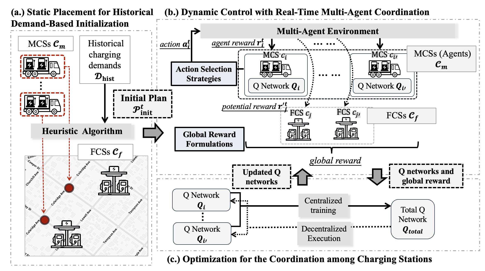

# MAC-DP: Multi-Agent Control for Dynamic Placement of Electric Vehicle Charging Stations

The **MAC-DP** framework (**M**ulti-**A**gent **C**ontrol for **D**ynamic **P**lacement of Electric Vehicle Charging Stations) explores advanced multi-agent reinforcement learning (MARL) techniques to optimize the real-time placement of charging infrastructure.



This work is built upon our previous paper, [2PM-MARL](https://link.springer.com/chapter/10.1007/978-981-97-2262-4_23) (*Ting et al., 2024*), publised in *PAKDD 2024*, which introduced a hybrid deployment of fixed charging stations (FCSs) and mobile charging stations (MCSs), MAC-DP enhances the coordination between FCSs and MCSs to improve EV user experience and operational efficiency.


## Introduction

The [2PM-MARL](https://link.springer.com/chapter/10.1007/978-981-97-2262-4_23) framework (*Our previous work*):
- Treats each MCS as an individual agent and utilizes MARL (Mult-Agent Reinforcement Learning) to dynamically control MCS placement.
- Reduces EV users' **travel** and **waiting times**.
- Balances the **utilization** of all charging stations to prevent unnecessary idleness.


### What MAC-DP Adds

In this work, we expand the investigation by:
- Exploring different **action selection strategies**
- Designing alternative **reward formulations**
- Evaluating various **agent training configurations**

These enhancements provide a deeper understanding of how MARL design choices influence system performance in dynamic, multi-agent environments.


## Experiments

📌 **Note**

This repository includes the main code for our proposed framework, MAC-DP.  
We are currently organizing and cleaning up the implementation, and the repo will be continuously updated.   

### Requirements
```
pip install -r requirements.txt
```

### Dataset
* `code/dataset/preprocess_data/Palto_Alto_2019_preprocess.csv`

### Hexagonal Grid Map

We build a hexagonal grid map using the [H3 library](https://github.com/uber/h3) in our work (`code/model/utils/hex_environment.py`).  
The grid map is automatically constructed when running our model `code/macdp.py`.

#### ⚙️ Map Settings

- **Hexagonal Tiling with H3**  
  `h3.polyfill()` is used to convert a polygon to H3 indices, then to `shapely.Polygon` hexagons.


- **Adjustable Resolution**  
  In our implementation, we use **resolution 8** for balanced granularity and efficiency.

- **Grid Locator**  
  The `located_grid()` function takes a (latitude, longitude) point and returns the index of the containing or nearest hexagon.


### Model
* `code/macdp.py`: Our main model.
- `code/variation/`: (models with different action selection strategies and reward formulations)
    - Different action selection strategies:
        * `macdp_1h_only.py`: restricts all MCSs (agents) can only move 1 hop in the hexagonal-grid map.
        * `macdp_1h_prior.py`: all MCSs (agents) can move 1 hop or 2 hops in the map, however, 1-hop action are assigned higher selection probabilities.
        * `macdp_2h_prior.py`: all MCSs (agents) can move 1 hop or 2 hops in the map, however, 2-hop action are assigned higher selection probabilities.
    - Different reward formulations:
        * `macdp_no_util.py`: eliminates the impact of utilization information for both MCSs and FCSs.
        * `macdp_weighted_F.py`: adjusts the contribution of potential rewards from FCSs in the global reward.

### Evaluation
* `code/evaluation/`
    * `eval-macdp.py`: evaluates the model generated from `macdp.py` and estimates the utilization of charging stations and charging delay cost (hr.).


## Contributors
This codebase is co-developed with the following members from [NetDB](https://ncku-ccs.github.io/netdb-web/), NCKU
- [You-Cheng Guo](https://github.com/ecfack)
- [Shih-Hsun Lin](https://github.com/ShlinBrian)